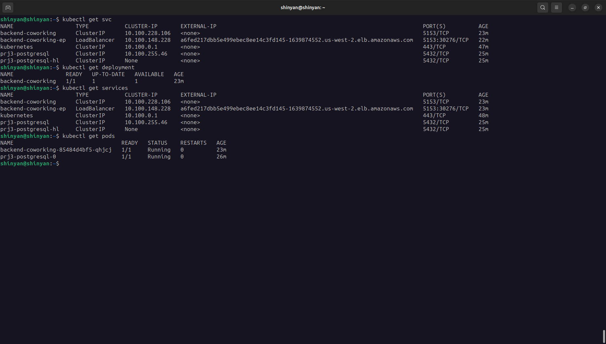
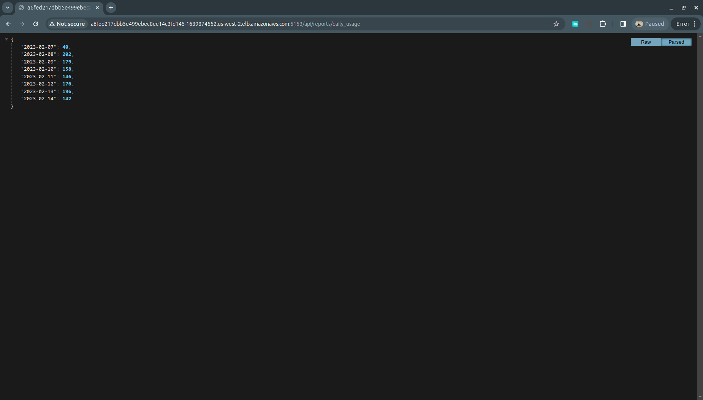
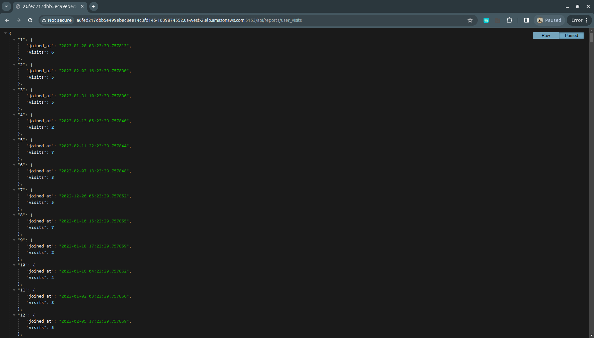
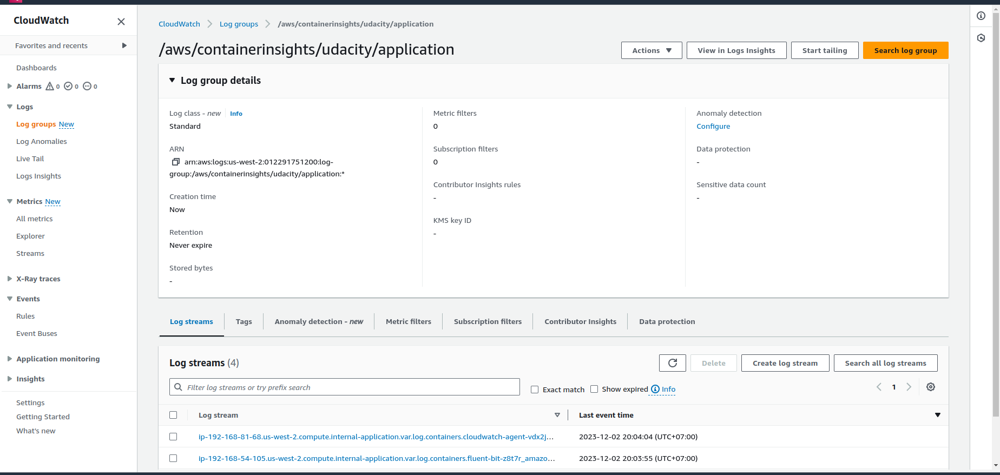
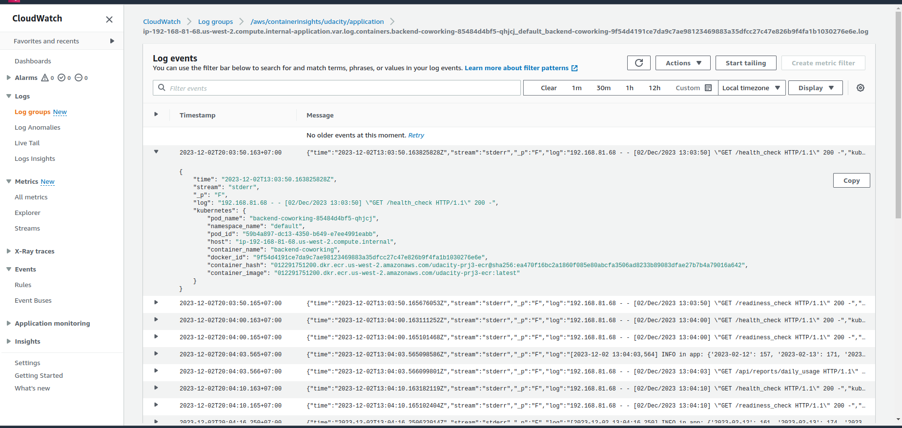

# Project: Operationalizing a Coworking Space Microservice

## Coworking Space Service Extension

The Coworking Space Service is a set of APIs that empower users to request one-time tokens, and administrators to authorize access to a coworking space. This service adheres to the microservice architectural pattern, with distinct services that can be deployed and managed independently.

As a DevOps engineer for this project, you'll collaborate with a team developing an API for business analysts. This API provides essential analytics data on user activity within the service. While the application functions correctly in a local environment, your task is to build a pipeline for its deployment in a Kubernetes cluster.

## Getting Started

### Dependencies

#### Local Environment
1. **Python Environment**: Required to run Python 3.6+ applications and install Python dependencies using `pip`.
2. **Docker CLI**: Essential for building and running Docker images locally.
3. **kubectl**: Necessary to execute commands against a Kubernetes cluster.
4. **helm**: Needed to apply Helm Charts to a Kubernetes cluster.

#### Remote Resources

1. **AWS CodeBuild**: Used for remote Docker image builds.
2. **AWS ECR**: Hosts Docker images.
3. **Kubernetes Environment with AWS EKS**: Deploys applications in Kubernetes.
4. **AWS CloudWatch**: Monitors activity and logs in EKS.
5. **GitHub**: Pulls and clones the code repository.


#### Project Structure
```shell
.
├── analytics
│   ├── app.py
│   ├── config.py
│   ├── Dockerfile
│   ├── __init__.py
│   ├── models.py
│   └── requirements.txt
├── bin
│   ├── clean.sh
│   ├── create-cluster.sh
│   ├── create_repository.sh
│   ├── install_awscli.sh
│   ├── install_eksctl.sh
│   ├── install_helm.sh
│   ├── install_psql.sh
│   └── shell.sh
├── buildspec.yml
├── CODEOWNERS
├── db
│   ├── 1_create_tables.sql
│   ├── 2_seed_users.sql
│   └── 3_seed_tokens.sql
├── deployment
│   ├── app.yml
│   ├── env-configmap.yml
│   └── env-secret.yml
```

- `bin`: Bash scripts to facilitate project tasks.
- `db`: SQL scripts for seeding data.
- `deployment`: Kubernetes YAML files for deployment and configuration.

#### How to Run

1. Run `bin/install*.sh`: Install necessary tools.
2. Run `bin/create-cluster.sh`: Create a Kubernetes cluster and update `kubectl` configuration.
3. Run `bin/helm_create_svc_pg.sh`: Create a PostgreSQL database service.
4. Run `bin/create_repository.sh`: Create an ECR repository.
5. Run `bin/deployment.sh`: Deploy using `kubectl`.
6. Run `bin/clean.sh`: Clean up deployments and services.

### CloudWatch Metrics in EKS

Refer to [CloudWatch Metrics in EKS](https://docs.aws.amazon.com/AmazonCloudWatch/latest/monitoring/install-CloudWatch-Observability-EKS-addon.html) for more information on CloudWatch metrics in EKS.

### Get Web API URL

To access the Web API, follow these steps:

1. Get the load balancer external IP:

   ```shell
   kubectl get svc
   ```

   

2. Access the Web API using the provided external IP.

   
   

### CloudWatch

View metrics and logs in CloudWatch:



